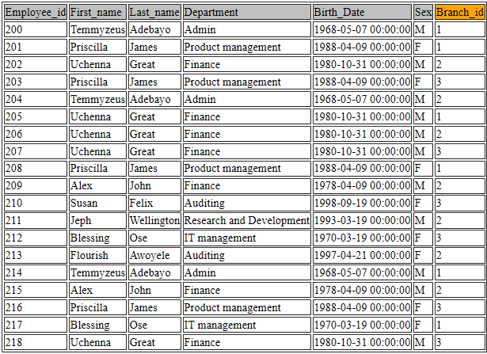
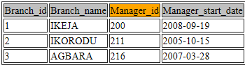
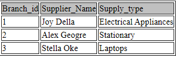

## CREATION COMPANY DATABASE

This project is a self taught of and developed project of which the data provided are assumed

**Built with**

- SQL
- Python

**Tools**

- MySQL Workbench
- Visual Studio Code

**Company Database Project**

MySQL project which builds the database of a company with various branches in different locations in Lagos Nigeria.  The database stores employees information in all the branches, uniquely identifies which branch an employee belongs to. 

- Primary Key - Employee_id 
- Foreign Key - Branch_id

The branch table contains information of when the current manager joined the organization and the branch they are heading,  the Manager_id being a foreign key with reference to the employee info(Employee_id) 

The client table was generated to know the company client and which branch they patronize the  most. The branch supplier table was created to know what is being supplied to various branch.

moving forward the database can be query to know;

- which Branch has the largest sales
- at what rate do they receive are re-order of supplies
- which branch has the most clients
-  the KPIs noted from the database 

Since this is a personal project the data was randomized using python

[LINK TO PYTHON PROJECT](https://github.com/ogemelody/Company--Database/blob/master/generate_sql-1.py)

